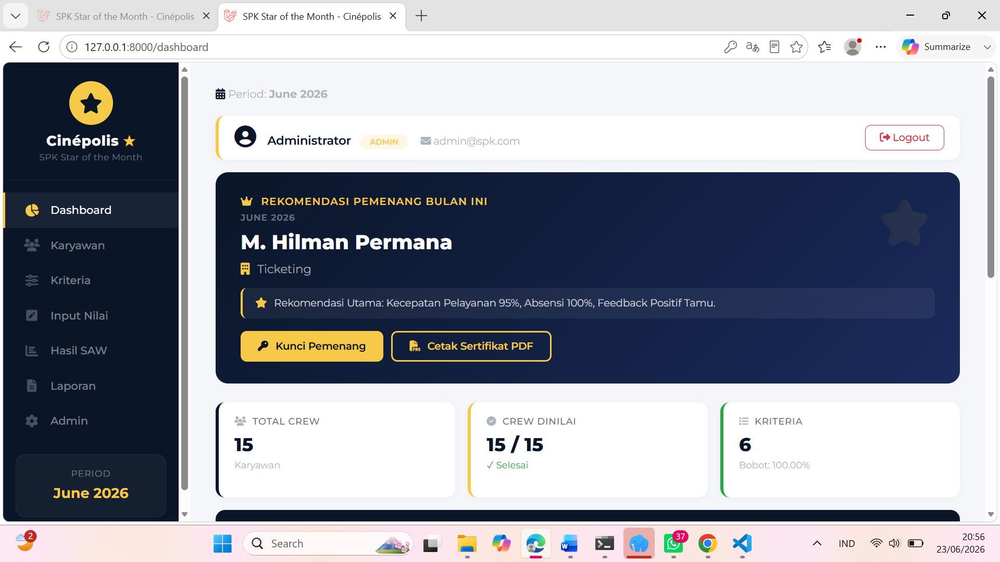

# Dokumentasi Sistem Pendukung Keputusan (SPK) - Metode SAW

Berikut adalah beberapa tampilan halaman utama yang ada di dalam sistem beserta penjelasan singkat fungsinya:

---

### 1. Dashboard Utama
Halaman awal yang memberikan ringkasan informasi sistem, statistik cepat, dan navigasi menu utama.

  

---

### 2. Data Karyawan
Halaman untuk mengelola data karyawan yang akan dijadikan sebagai alternatif objek evaluasi.

  

---

### 3. Data Kriteria
Halaman yang menampilkan daftar kriteria penilain beserta bobot masing-masing kriteria dan jenis sifatnya (*benefit* atau *cost*).

  

---

### 4. Input Nilai
Formulir evaluasi yang digunakan pengguna untuk memasukkan nilai matriks kecocokan setiap karyawan terhadap kriteria yang ditentukan.

  

---

### 5. Hasil Perhitungan SAW
Halaman yang menampilkan tahapan perhitungan rumus SAW secara transparan, mulai dari pembentukan matriks keputusan hingga proses normalisasi.

  

---

### 6. Hasil Laporan SAW
Laporan akhir yang berisi hasil pemeringkatan (ranking) karyawan berdasarkan nilai preferensi tertinggi dari perhitungan metode SAW.

  

